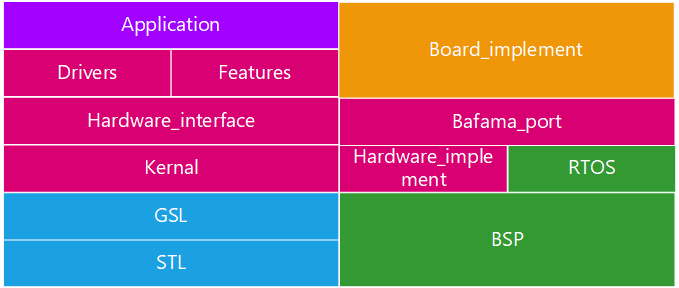

# Bafama


Bafama is an open source embedded c++ best practice framework for smart wear.

It includes all the features you need to develop a smart wear, including display, storage, algorithm, communication, drivers for sensors.

# Features

## writing by modern c++

## compatibility with Keil (armcc)

​	In smart wear, most MCU manufacturers only provide Keil build environment.

## power full and fast GUI based on GUIX

## partial frame buffers support

TODO

# Background and scope

TODO

# Architecture diagram



The blocks which are read(Drivers, Features, Hardware_interface, Kernel, Hardware_implement, Bafama_port)  provide by this repository.

The blocks which are green(RTOS, BSP) provide by MCU manufacturers.

The blocks which is orange(Board_implement) provide by PCBA manufacturers.

The blocks which is purple(Application) provide by smart wear developer.

# Target

TODO

- 

# License

Unless stated elsewhere, file headers or otherwise, all files herein are licensed under an GPLv3 license. For more information, please read the LICENSE file.

# Contribute

Bafama is an open project .

Welcome to submit pull request like writing examples, improving the documentation, fixing bugs .

# Style

## Code style

We use clang_format to format our code with sort includes false.

```
"{BasedOnStyle: LLVM, UseTab: Never, IndentWidth: 4, TabWidth: 4, BreakBeforeBraces: Allman, AllowShortIfStatementsOnASingleLine: false, IndentCaseLabels: false, ColumnLimit: 200, AccessModifierOffset: -4, NamespaceIndentation: All, AllowShortFunctionsOnASingleLine: None }"
```

# CONNECT


Having problems or have awesome suggestions? Connect with us [woodsking2@hotmail.com](mailto:woodsking2@hotmail.com)